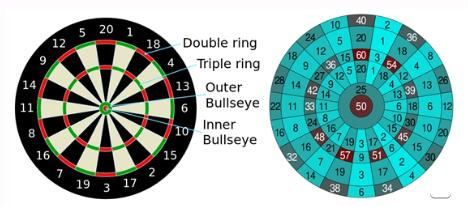

Darts is tegenwoordig een erg populair spel. Een speler gooit elke beurt 3 pijlen naar een bord. Dat bord is in sectoren verdeeld die elk een specifieke waarde hebben tussen 1 en 20. Deze punten worden verdubbeld als de pijl in de buitenste rand van de sector (de double ring) terechtkomt, en worden verdriedubbeld als de pijl in de ring in het midden van de sector (de triple ring) terechtkomt.  
Ten slotte is er in het midden van het bord een kleine rode cirkel (de roos of 'double bull') en daarrond een groene cirkel (de 'single bull'). Die leveren resp. 50 en 25 punten op.  
Dat geeft volgend overzicht:  
  
 
  
- als de pijl in de roos terechtkomt, dan noteren we dat als **BULL** en is de worp **50** punten waard.  
- als de pijl in de groene zone rond de roos terechtkomt, dan noteren we dat als **SBULL** (single bull) en is de worp **25** punten waard.  
- als de pijl in de binnenste cirkel van een sector (de triple ring) terechtkomt, dan is de worp het drievoud van de sectorwaarde waard. Bijvoorbeeld: als de pijl geland is in de triple ring van sector 20, dan noteren we dat als **T20** (triple 20) en is de worp **60** punten waard. Dat is de maximale score die met een worp behaald kan worden.  
- als de pijl in de buitenste cirkel aan de rand van een sector (de double ring) terechtkomt, dan is de worp het tweevoud van de sectorwaarde waard. Bijvoorbeeld: als de pijl geland is in de double ring van sector 14, dan noteren we dat als **D14** (double 14) en is de worp **28** punten waard.  
- als de pijl in een sector terechtkomt maar niet in de double of triple ring, dan is de worp de waarede van de sector waard en noteren we gewoon dat getal. Bijvoorbeeld: als de pijl geland is in sector 13, dan noteren we **13** en is de worp **13** punten waard.  
  
Schrijf een functie `dartsWorp` die de notatie van de plaats waar de pijl terechtkomt, binnenkrijgt en daaruit het aantal behaalde punten teruggeeft. Je functie krijgt dus als invoer een tekst binnen ("BULL", "SBULL", "D20", "T8", "17") en geeft als uitvoerwaarde de waarde van de worp als integer terug. Omdat je in sommige gevallen de eerste letter (een "T" of een "D") uit de invoerparameter moet verwijderen krijg je nog wat info cadeau:  
- de eerste letter van een woord kan je lezen door het woord te beschouwen als een lijst. Het eerste element van de lijst is dan **[0]** .  
- je krijgt ook een functie cadeau die een woord teruggeeft zonder de eerste letter. Deze functie heeft de naam `extractPos2` en zal, bijvoorbeeld, als de invoerparameter gelijk is aan *T20* de waarde *20* teruggeven.  